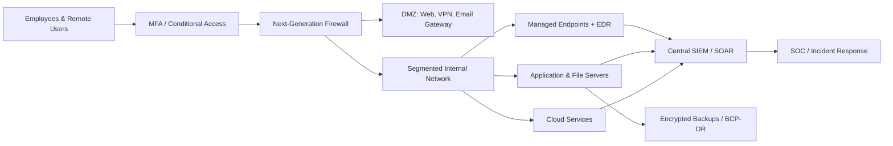
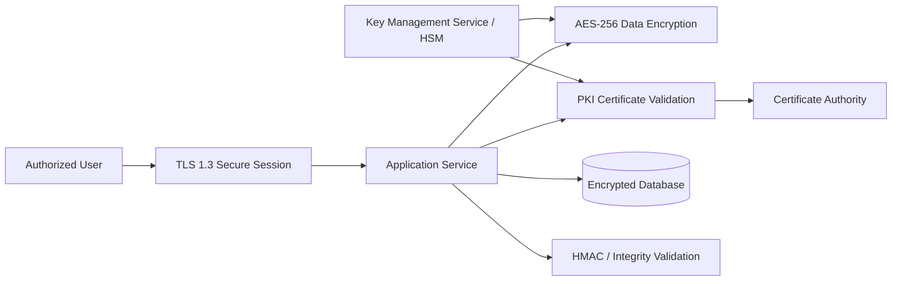
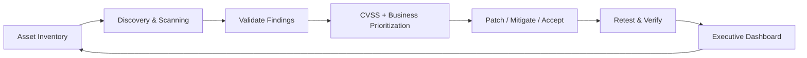
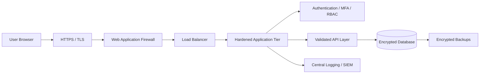
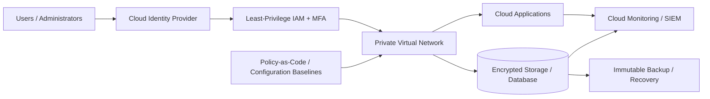
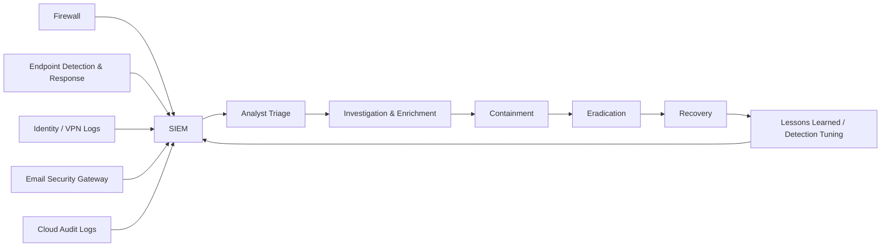

# Cybersecurity Portfolio Architecture Diagrams

These diagrams are designed for GitHub, the portfolio website, presentations, and recruiter walkthroughs.

## 1. Northbridge Logistics — Defense-in-Depth

## 2. Cryptography & Secure Network Architecture

## 3. Threat & Vulnerability Management Lifecycle

## 4. Secure Web Application Architecture

## 5. Cloud Security Foundations

## 6. SOC Alert Triage & Incident Response

## Usage Notes

- Mermaid renders automatically in GitHub Markdown.
- Export each diagram as SVG or PNG for the portfolio book, Canva, and PowerPoint.
- Keep sensitive details, real IP addresses, credentials, and organizational identifiers excluded.
